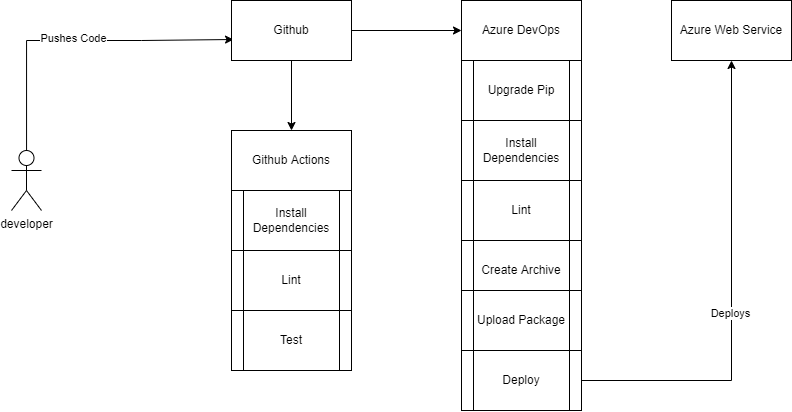
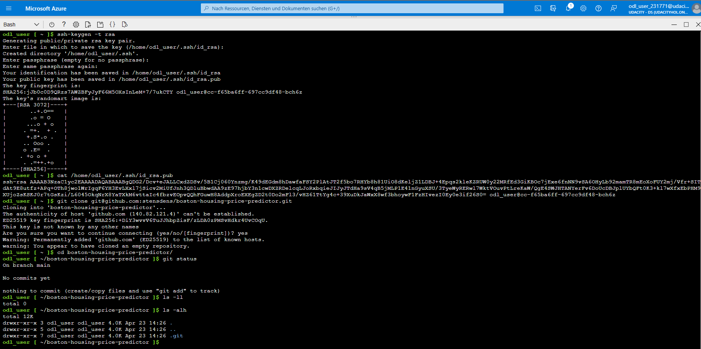
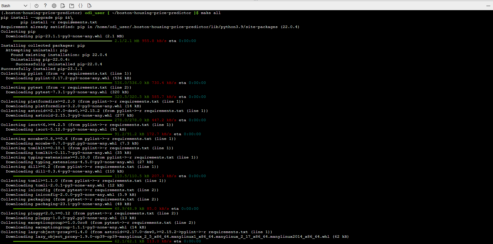
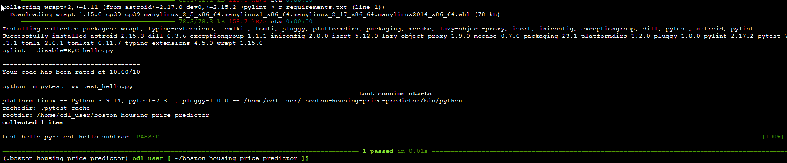
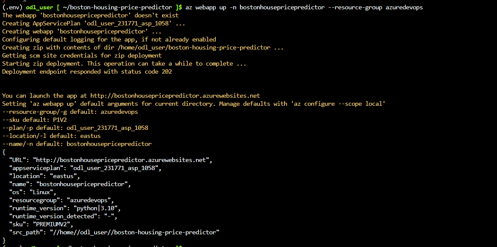
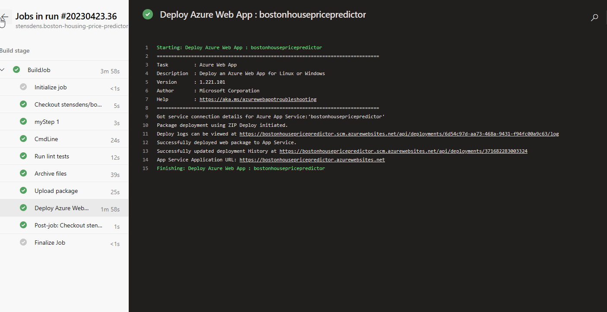

# Overview

This simple flask application can be used to predict the boston housing prices.


## Project Plan


This is the [Trello Board](https://trello.com/b/47mH7lOy/boston-house-prices) tracking the tasks for the project.

The spreadsheet can be found under [Project Plan](project-management.xlsx)

## Instructions

Architectural Overview



* Project running on Azure App Service

Login into azure and open your Azure Cloud Shell

Create a ssh key and add it to your github account

Then clone the project

build it by executing make all

then you can run it via python app.py

you can perform a prediction by executing the script make_prediction.sh


* Project cloned into Azure Cloud Shell


* Passing tests that are displayed after running the `make all` command from the `Makefile`

* Output of a test run




* Successful deploy of the project in Azure Pipelines.  

)

* Running Azure App Service from Azure Pipelines automatic deployment



````bash
odl_user [ ~ ]$ az webapp list
[
  {
    "appServicePlanId": "/subscriptions/c9f1e8cb-24a3-405b-9046-bf2b34125d0c/resourceGroups/azuredevops/providers/Microsoft.Web/serverfarms/odl_user_231771_asp_1058",
    "availabilityState": "Normal",
    "clientAffinityEnabled": true,
    "clientCertEnabled": false,
    "clientCertExclusionPaths": null,
    "clientCertMode": "Required",
    "cloningInfo": null,
    "containerSize": 0,
    "customDomainVerificationId": "8DC703F7B5A4A956F44B33A45D1F5E33C60E69690C0750905A0792BCDECBC338",
    "dailyMemoryTimeQuota": 0,
    "defaultHostName": "bostonhousepricepredictor.azurewebsites.net",
    "enabled": true,
    "enabledHostNames": [
      "bostonhousepricepredictor.azurewebsites.net",
      "bostonhousepricepredictor.scm.azurewebsites.net"
    ],
    "extendedLocation": null,
    "hostNameSslStates": [
      {
        "certificateResourceId": null,
        "hostType": "Standard",
        "ipBasedSslResult": null,
        "ipBasedSslState": "NotConfigured",
        "name": "bostonhousepricepredictor.azurewebsites.net",
        "sslState": "Disabled",
        "thumbprint": null,
        "toUpdate": null,
        "toUpdateIpBasedSsl": null,
        "virtualIp": null
      },
      {
        "certificateResourceId": null,
        "hostType": "Repository",
        "ipBasedSslResult": null,
        "ipBasedSslState": "NotConfigured",
        "name": "bostonhousepricepredictor.scm.azurewebsites.net",
        "sslState": "Disabled",
        "thumbprint": null,
        "toUpdate": null,
        "toUpdateIpBasedSsl": null,
        "virtualIp": null
      }
    ],
    "hostNames": [
      "bostonhousepricepredictor.azurewebsites.net"
    ],
    "hostNamesDisabled": false,
    "hostingEnvironmentProfile": null,
    "httpsOnly": true,
    "hyperV": false,
    "id": "/subscriptions/c9f1e8cb-24a3-405b-9046-bf2b34125d0c/resourceGroups/azuredevops/providers/Microsoft.Web/sites/bostonhousepricepredictor",
    "identity": null,
    "inProgressOperationId": null,
    "isDefaultContainer": null,
    "isXenon": false,
    "keyVaultReferenceIdentity": "SystemAssigned",
    "kind": "app,linux",
    "lastModifiedTimeUtc": "2023-04-23T20:37:08.870000",
    "location": "East US",
    "maxNumberOfWorkers": null,
    "name": "bostonhousepricepredictor",
    "outboundIpAddresses": "52.224.129.5,52.224.129.35,52.224.129.250,52.224.130.74,52.224.130.227,52.224.131.218,20.49.104.8",
    "possibleOutboundIpAddresses": "52.191.102.28,52.191.102.155,52.191.102.233,52.191.103.216,52.191.96.255,52.224.128.162,52.224.129.5,52.224.129.35,52.224.129.250,52.224.130.74,52.224.130.227,52.224.131.218,52.190.44.200,52.190.45.17,52.190.45.31,52.190.45.66,52.190.46.42,52.190.46.122,52.226.170.10,52.226.171.23,52.226.171.127,52.226.171.142,52.226.172.29,52.226.172.35,20.49.104.8",
    "publicNetworkAccess": null,
    "redundancyMode": "None",
    "repositorySiteName": "bostonhousepricepredictor",
    "reserved": true,
    "resourceGroup": "azuredevops",
    "scmSiteAlsoStopped": false,
    "siteConfig": {
      "acrUseManagedIdentityCreds": false,
      "acrUserManagedIdentityId": null,
      "alwaysOn": true,
      "antivirusScanEnabled": null,
      "apiDefinition": null,
      "apiManagementConfig": null,
      "appCommandLine": null,
      "appSettings": null,
      "autoHealEnabled": null,
      "autoHealRules": null,
      "autoSwapSlotName": null,
      "azureMonitorLogCategories": null,
      "azureStorageAccounts": null,
      "connectionStrings": null,
      "cors": null,
      "customAppPoolIdentityAdminState": null,
      "customAppPoolIdentityTenantState": null,
      "defaultDocuments": null,
      "detailedErrorLoggingEnabled": null,
      "documentRoot": null,
      "elasticWebAppScaleLimit": null,
      "experiments": null,
      "fileChangeAuditEnabled": null,
      "ftpsState": null,
      "functionAppScaleLimit": 0,
      "functionsRuntimeScaleMonitoringEnabled": null,
      "handlerMappings": null,
      "healthCheckPath": null,
      "http20Enabled": true,
      "http20ProxyFlag": null,
      "httpLoggingEnabled": null,
      "ipSecurityRestrictions": null,
      "ipSecurityRestrictionsDefaultAction": null,
      "javaContainer": null,
      "javaContainerVersion": null,
      "javaVersion": null,
      "keyVaultReferenceIdentity": null,
      "limits": null,
      "linuxFxVersion": "PYTHON|3.10",
      "loadBalancing": null,
      "localMySqlEnabled": null,
      "logsDirectorySizeLimit": null,
      "machineKey": null,
      "managedPipelineMode": null,
      "managedServiceIdentityId": null,
      "metadata": null,
      "minTlsCipherSuite": null,
      "minTlsVersion": null,
      "minimumElasticInstanceCount": 0,
      "netFrameworkVersion": null,
      "nodeVersion": null,
      "numberOfWorkers": 1,
      "phpVersion": null,
      "powerShellVersion": null,
      "preWarmedInstanceCount": null,
      "publicNetworkAccess": null,
      "publishingPassword": null,
      "publishingUsername": null,
      "push": null,
      "pythonVersion": null,
      "remoteDebuggingEnabled": null,
      "remoteDebuggingVersion": null,
      "requestTracingEnabled": null,
      "requestTracingExpirationTime": null,
      "routingRules": null,
      "runtimeADUser": null,
      "runtimeADUserPassword": null,
      "scmIpSecurityRestrictions": null,
      "scmIpSecurityRestrictionsDefaultAction": null,
      "scmIpSecurityRestrictionsUseMain": null,
      "scmMinTlsVersion": null,
      "scmType": null,
      "sitePort": null,
      "storageType": null,
      "supportedTlsCipherSuites": null,
      "tracingOptions": null,
      "use32BitWorkerProcess": null,
      "virtualApplications": null,
      "vnetName": null,
      "vnetPrivatePortsCount": null,
      "vnetRouteAllEnabled": null,
      "webSocketsEnabled": null,
      "websiteTimeZone": null,
      "winAuthAdminState": null,
      "winAuthTenantState": null,
      "windowsConfiguredStacks": null,
      "windowsFxVersion": null,
      "xManagedServiceIdentityId": null
    },
    "slotSwapStatus": null,
    "state": "Running",
    "storageAccountRequired": false,
    "suspendedTill": null,
    "tags": null,
    "targetSwapSlot": null,
    "trafficManagerHostNames": null,
    "type": "Microsoft.Web/sites",
    "usageState": "Normal",
    "virtualNetworkSubnetId": null,
    "vnetContentShareEnabled": false,
    "vnetImagePullEnabled": false,
    "vnetRouteAllEnabled": false
  }
]
````

* Successful prediction from deployed flask app in Azure Cloud Shell. 

```bash
(.env) odl_user [ ~/boston-housing-price-predictor ]$ ./make_predict_azure_app.sh 
Port: 443
{"prediction":[2.431574790057212]}
(.env) odl_user [ ~/boston-housing-price-predictor ]$ 
```


* Output of streamed log files from deployed application

> 2023-04-23T20:55:23.401153905Z 169.254.129.1 - - [23/Apr/2023:20:55:23 +0000] "POST /predict HTTP/1.1" 200 35 "-" "curl/7.88.1"
2023-04-23T20:55:30.295450099Z /tmp/8db443cb09a13c5/antenv/lib/python3.10/site-packages/sklearn/base.py:329: UserWarning: Trying to unpickle estimator LinearRegression from version 1.1.3 when using version 1.0.2. This might lead to breaking code or invalid results. Use at your own risk. For more info please refer to:
2023-04-23T20:55:30.295490003Z https://scikit-learn.org/stable/modules/model_persistence.html#security-maintainability-limitations
2023-04-23T20:55:30.295497203Z   warnings.warn(
2023-04-23T20:55:30.297392567Z [2023-04-23 20:55:30,295] INFO in app: JSON payload: %s json_payload
2023-04-23T20:55:30.298551466Z [2023-04-23 20:55:30,298] INFO in app: inference payload DataFrame: %s inference_payload
2023-04-23T20:55:30.301040381Z [2023-04-23 20:55:30,300] INFO in app: Scaling Payload: %s payload
2023-04-23T20:55:30.306648464Z [2023-04-23 20:55:30,306] INFO in app: Predicted value is: [2.431574790057212]
2023-04-23T20:55:30.309914446Z 169.254.129.1 - - [23/Apr/2023:20:55:30 +0000] "POST /predict HTTP/1.1" 200 35 "-" "curl/7.88.1"


* Run performance test via locus


````bash
sdrag@DESKTOP-KH8BSO9 MINGW64 /d/workspace/boston-housing-price-predictor
$ locust --headless --users 1 --spawn-rate 10 -H https://bostonhousepricepredictor.azurewebsites.net/
[2023-04-23 23:51:18,039] DESKTOP-KH8BSO9/INFO/locust.main: No run time limit set, use CTRL+C to interrupt
[2023-04-23 23:51:18,040] DESKTOP-KH8BSO9/INFO/locust.main: Starting Locust 2.15.1                                                                              
Type     Name                                                                          # reqs      # fails |    Avg     Min     Max    Med |   req/s  failures/s
--------|----------------------------------------------------------------------------|-------|-------------|-------|-------|-------|-------|--------|-----------
--------|----------------------------------------------------------------------------|-------|-------------|-------|-------|-------|-------|--------|-----------
         Aggregated                                                                         0     0(0.00%) |      0       0       0      0 |    0.00        0.00
                                                                                                                                                                
[2023-04-23 23:51:18,041] DESKTOP-KH8BSO9/INFO/locust.runners: Ramping to 1 users at a rate of 10.00 per second                                                 
[2023-04-23 23:51:18,041] DESKTOP-KH8BSO9/INFO/locust.runners: All users spawned: {"QuickstartUser": 1} (1 total users)                                         
Type     Name                                                                          # reqs      # fails |    Avg     Min     Max    Med |   req/s  failures/s
--------|----------------------------------------------------------------------------|-------|-------------|-------|-------|-------|-------|--------|-----------
POST     //predict                                                                          1     0(0.00%) |    488     488     488    488 |    0.00        0.00
--------|----------------------------------------------------------------------------|-------|-------------|-------|-------|-------|-------|--------|-----------
         Aggregated                                                                         1     0(0.00%) |    488     488     488    488 |    0.00        0.00

Type     Name                                                                          # reqs      # fails |    Avg     Min     Max    Med |   req/s  failures/s
--------|----------------------------------------------------------------------------|-------|-------------|-------|-------|-------|-------|--------|-----------
POST     //predict                                                                          1     0(0.00%) |    488     488     488    488 |    0.00        0.00
--------|----------------------------------------------------------------------------|-------|-------------|-------|-------|-------|-------|--------|-----------
         Aggregated                                                                         1     0(0.00%) |    488     488     488    488 |    0.00        0.00

Type     Name                                                                          # reqs      # fails |    Avg     Min     Max    Med |   req/s  failures/s
--------|----------------------------------------------------------------------------|-------|-------------|-------|-------|-------|-------|--------|-----------
POST     //predict                                                                          2     0(0.00%) |    303     118     488    120 |    0.33        0.00
--------|----------------------------------------------------------------------------|-------|-------------|-------|-------|-------|-------|--------|-----------
         Aggregated                                                                         2     0(0.00%) |    303     118     488    120 |    0.33        0.00

         Aggregated                                                                         2     0(0.00%) |    303     118     488    120 |    0.33        0.00

Type     Name                                                                          # reqs      # fails |    Avg     Min     Max    Med |   req/s  failures/s
Type     Name                                                                          # reqs      # fails |    Avg     Min     Max    Med |   req/s  failures/s
--------|----------------------------------------------------------------------------|-------|-------------|-------|-------|-------|-------|--------|-----------
POST     //predict                                                                          2     0(0.00%) |    303     118     488    120 |    0.33        0.00
--------|----------------------------------------------------------------------------|-------|-------------|-------|-------|-------|-------|--------|-----------
POST     //predict                                                                          2     0(0.00%) |    303     118     488    120 |    0.33        0.00
--------|----------------------------------------------------------------------------|-------|-------------|-------|-------|-------|-------|--------|-----------
         Aggregated                                                                         2     0(0.00%) |    303     118     488    120 |    0.33        0.00

Type     Name                                                                          # reqs      # fails |    Avg     Min     Max    Med |   req/s  failures/s
--------|----------------------------------------------------------------------------|-------|-------------|-------|-------|-------|-------|--------|-----------
POST     //predict                                                                          3     0(0.00%) |    244     118     488    130 |    0.25        0.00
--------|----------------------------------------------------------------------------|-------|-------------|-------|-------|-------|-------|--------|-----------
         Aggregated                                                                         3     0(0.00%) |    244     118     488    130 |    0.30        0.00

Response time percentiles (approximated)
Type     Name                                                                                  50%    66%    75%    80%    90%    95%    98%    99%  99.9% 99.99%   100% # reqs
--------|--------------------------------------------------------------------------------|--------|------|------|------|------|------|------|------|------|------|------|------
POST     //predict                                                                             130    130    490    490    490    490    490    490    490    490    490      3
--------|--------------------------------------------------------------------------------|--------|------|------|------|------|------|------|------|------|------|------|------
         Aggregated                                                                            130    130    490    490    490    490    490    490    490    490    490      3

()

````

## Enhancements

- it should be possible to select the library which is used in the prediction
- better error codes


## Demo 

[See the demo here](https://youtu.be/d3Agl9_dXhk)


